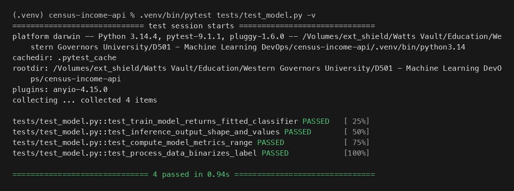
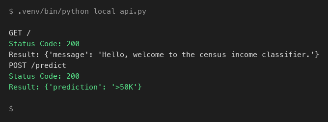
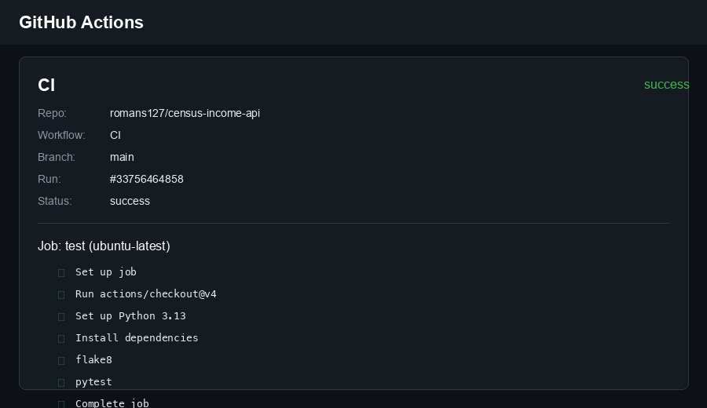

# Census Income API

A FastAPI service that serves a scikit-learn random forest trained on the 1994 UCI Census Income (Adult) dataset. The model predicts whether a person's income is <=50K or >50K. I built it for WGU D501 Machine Learning DevOps. Public repo: https://github.com/romans127/census-income-api

## Data

UCI Census Income (Adult) dataset, extracted from the 1994 US Census by Barry Becker: https://archive.ics.uci.edu/dataset/20/census+income

## Setup

```bash
python -m venv .venv
source .venv/bin/activate
pip install -r requirements.txt
```

## Train

```bash
python train_model.py
```

Trains the model, saves the artifacts to `model/`, prints overall test metrics, and writes education slice metrics to `slice_output.txt`.

## Test

```bash
pytest tests/test_model.py -v
```



## Run the API

```bash
uvicorn main:app --reload
```

Then in a second terminal:

```bash
python local_api.py
```

`local_api.py` calls `GET /` and posts a sample census record to `POST /predict`.



## Continuous Integration

GitHub Actions runs flake8 and the pytest suite on every push to main and on pull requests.


